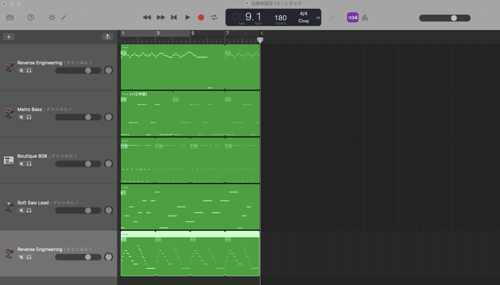

# MIDI MCP Server

## Overview
MIDI MCP Server is a Model Context Protocol (MCP) server that enables AI models to generate MIDI files from text-based music data. This tool allows for programmatic creation of musical compositions through a standardized interface.



## Installation

```bash
npm install
npm run build
```

## Usage with MCP Clients (e.g., Cline)

After building the project, simply add the server to your MCP client configuration:

```json
"mcpServers": {
    "musicComposer": {
        "command": "node",
        "args": ["/path/to/midi-mcp-server/build/index.js"]
    }
}
```

Replace `/path/to/` with the actual path to your project directory.

## Features

- Generate MIDI files from structured JSON music data
- Support for multiple tracks and instruments
- Customizable tempo, time signature, and note properties
- Save MIDI files to specified locations

## Tool: create_midi

The server provides a tool called `create_midi` that generates MIDI files from structured music data.

### Input Parameters

- `title`: String - The title of the composition
- `composition`: String - A JSON string representing the music data
- `output_path`: String - Path where the MIDI file will be saved

### Composition Format

The composition should follow this structure:

```json
{
  "bpm": number,
  "timeSignature": { "numerator": number, "denominator": number },
  "tracks": [
    {
      "name": string,
      "instrument": number,
      "notes": [
        { "pitch": number, "startTime": number, "duration": number, "velocity": number }
      ]
    }
  ]
}
```

#### Properties

- `bpm`: Tempo in beats per minute
- `timeSignature`: Time signature (e.g., `{numerator: 4, denominator: 4}` for 4/4 time)
- `tracks`: Array of instrument tracks
    - `name`: Track name
    - `instrument`: MIDI program number (0-127)
    - `notes`: Array of note objects
        - `pitch`: MIDI note number (0-127)
        - `startTime`: Start time in beats
        - `duration`: Note duration in beats
        - `velocity`: Note velocity/volume (0-127)

## Example

```javascript
const composition = {
  "bpm": 120,
  "timeSignature": { "numerator": 4, "denominator": 4 },
  "tracks": [
    {
      "name": "Piano",
      "instrument": 0,
      "notes": [
        { "pitch": 60, "startTime": 0, "duration": 1, "velocity": 100 },
        { "pitch": 64, "startTime": 1, "duration": 1, "velocity": 100 },
        { "pitch": 67, "startTime": 2, "duration": 1, "velocity": 100 }
      ]
    }
  ]
};
```

## Dependencies

- @modelcontextprotocol/sdk: MCP server implementation
- midi-writer-js: Library for creating MIDI files

## Demo

For example, the prompt below, which is a request to create a minor scale 8-bar choral piece, can be processed by the server:

```text
8小節の合唱曲を作って。
若干マイナー調で、メロディックな音階を作ってほしい
```


https://github.com/user-attachments/assets/1dd12911-61fb-427b-8486-ff66adc74d86


[melodic_minor_chorus.mid](docs/melodic_minor_chorus.mid)

## Note on Local Execution

This MCP server runs locally and communicates via standard input/output (stdio). No network configuration is required as the MCP client will automatically start the server process and establish communication.

