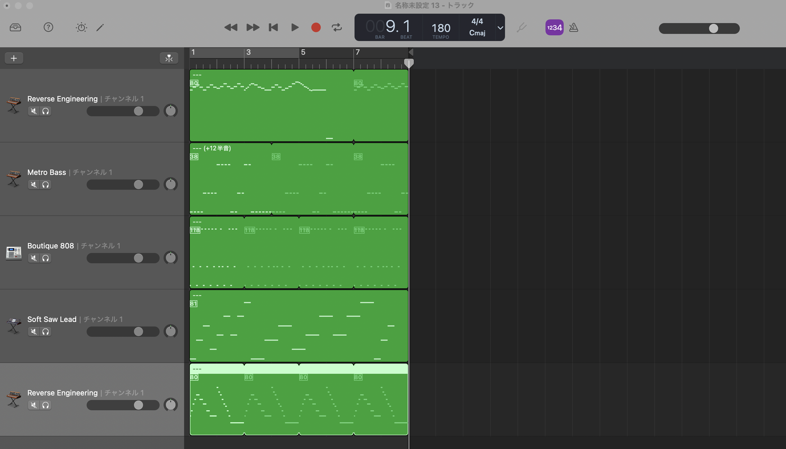

[](https://mseep.ai/app/tubone24-midi-mcp-server)

[](https://mseep.ai/app/74175d16-e83a-4509-b7ab-31ff1c59cef8)

# MIDI MCP Server

A [Model Context Protocol (MCP)](https://modelcontextprotocol.io/) server for AI-driven MIDI composition. Generate MIDI files from structured JSON data, with chord name support, an interactive piano-roll preview UI, and multiple deployment modes.


> **Looking for the Agent Skills approach?** It composes better songs with less context:
> [tubone24/midi-agent-skill](https://github.com/tubone24/midi-agent-skill)

---

## Features

- **Two MCP tools**: `create_midi` (with interactive preview UI) and `parse_chord`
- **Rich pitch input**: MIDI numbers, note name strings (`"C4"`), pitch arrays, or chord names (`"Cmaj7"`)
- **Chord library**: 25+ chord qualities — major, minor, dim, aug, 7th, maj7, m7, sus2, sus4, power, and more
- **Flexible durations**: numeric beats, standard strings (`'4'`, `'8'`), dotted (`'d4'`), triplet (`'T8'`)
- **Music theory resources**: 7 built-in reference documents accessible as MCP resources
- **Three transport modes**: stdio, HTTP, or Cloudflare Workers (remote)
- **MCP App UI**: Piano-roll visualization and audio playback rendered directly in the conversation

---

## Deployment Options

### Option A — Remote (Cloudflare Workers)

A pre-deployed remote server is available:

```
https://midi-mcp-server.tubone24.workers.dev/mcp
```

Add it to any MCP client that supports Streamable HTTP (e.g., Claude.ai):

```json
{
  "mcpServers": {
    "midi": {
      "type": "http",
      "url": "https://midi-mcp-server.tubone24.workers.dev/mcp"
    }
  }
}
```

### Option B — Local stdio (recommended for desktop clients)

Build and configure as a local stdio server:

```bash
npm install
npm run build
```

```json
{
  "mcpServers": {
    "musicComposer": {
      "command": "node",
      "args": ["/path/to/midi-mcp-server/build/index.js"]
    }
  }
}
```

### Option C — Local HTTP

Run as a local Streamable HTTP server:

```bash
node build/index.js --http
# or with a custom port:
node build/index.js --http --port=8080
```

The server exposes:
- `POST /mcp` — MCP Streamable HTTP endpoint
- `GET /health` — Health check (`{"status":"ok","version":"0.2.0"}`)

---

## Tools

### `create_midi`

Generate a MIDI file from structured composition data. Returns base64-encoded MIDI and renders an interactive piano-roll preview with audio playback in supported MCP clients (MCP App).



**Input**

| Field | Type | Required | Description |
|-------|------|----------|-------------|
| `title` | `string` | ✓ | Title of the composition |
| `composition` | `object` | ✓ | Composition data (see schema below) |

**Output** (structured content)

| Field | Type | Description |
|-------|------|-------------|
| `midiBase64` | `string` | Base64-encoded MIDI file data |
| `title` | `string` | Composition title |
| `bpm` | `number` | Tempo used |
| `trackCount` | `number` | Number of tracks generated |

---

### `parse_chord`

Parse a chord name and return its component MIDI pitches and note names. Useful for understanding voicings before composing.

**Input**

| Field | Type | Required | Description |
|-------|------|----------|-------------|
| `chord` | `string` | ✓ | Chord name, e.g. `"Cmaj7"`, `"F#m7"`, `"G7sus4"` |
| `octave` | `number` | — | Root octave (default: `4`) |

**Output example**

```json
{
  "chord": "Cmaj7",
  "octave": 4,
  "midiNumbers": [60, 64, 67, 71],
  "noteNames": ["C4", "E4", "G4", "B4"]
}
```

---

## Composition Schema

```jsonc
{
  "bpm": 120,                              // tempo (also accepted: "tempo")
  "timeSignature": { "numerator": 4, "denominator": 4 },  // optional, default 4/4
  "tracks": [
    {
      "name": "Piano",                     // optional
      "instrument": 0,                     // GM program number 0–127 (optional)
      "notes": [
        {
          "pitch": 60,                     // MIDI number, note name "C4", or array [60, 64, 67]
          "chord": "Cmaj7",                // OR use chord name (overrides pitch)
          "beat": 1,                       // beat position (1-based); OR use startTime
          "startTime": 0,                  // tick offset (alias: "time")
          "duration": "4",                 // see Duration Reference below
          "velocity": 100,                 // 0–127 (optional, default 100)
          "channel": 0                     // MIDI channel 0–15 (optional)
        }
      ]
    }
  ]
}
```

### Pitch Input Formats

| Format | Example | Description |
|--------|---------|-------------|
| MIDI number | `60` | Standard MIDI note number (0–127) |
| Note name | `"C4"` | Letter + optional accidental + octave |
| Pitch array | `[60, 64, 67]` | Multiple pitches played simultaneously |
| Chord field | `chord: "Cmaj7"` | Chord name expanded automatically |

Supported accidentals: `#` (sharp), `b` (flat). Examples: `"F#5"`, `"Bb3"`.

### Duration Reference

| Value | Description |
|-------|-------------|
| `'1'` | Whole note |
| `'2'` | Half note |
| `'4'` | Quarter note |
| `'8'` | Eighth note |
| `'16'` | Sixteenth note |
| `'32'` | Thirty-second note |
| `'d1'` `'d2'` `'d4'` `'d8'` `'d16'` | Dotted variants |
| `'dd4'` | Double-dotted quarter |
| `'T4'` `'T8'` … | Triplet variants |
| `4` (number) | Beat-based: `1`=quarter, `2`=half, `4`=whole, `0.5`=eighth |

### Supported Chord Qualities

| Quality | Example | Description |
|---------|---------|-------------|
| _(none)_ / `maj` | `C`, `Cmaj` | Major |
| `m` / `min` | `Dm` | Minor |
| `dim` | `Bdim` | Diminished |
| `aug` | `Eaug` | Augmented |
| `7` | `G7` | Dominant 7th |
| `maj7` / `M7` | `Cmaj7` | Major 7th |
| `m7` / `min7` | `Am7` | Minor 7th |
| `dim7` | `Bdim7` | Diminished 7th |
| `m7b5` | `Bm7b5` | Half-diminished |
| `aug7` | `Eaug7` | Augmented 7th |
| `6` / `m6` | `C6`, `Am6` | 6th |
| `9` / `maj9` / `m9` | `G9` | 9th variants |
| `add9` | `Cadd9` | Add 9th |
| `11` / `13` | `C11` | Extended |
| `sus2` / `sus4` | `Gsus4` | Suspended |
| `7sus4` / `7sus2` | `G7sus4` | 7th suspended |
| `power` / `5` | `G5` | Power chord |

---

## MCP Resources

The server exposes 7 music theory reference documents as MCP resources:

| URI | Description |
|-----|-------------|
| `music-theory://harmony` | Intervals, chord types, diatonic chords, cadences, voice leading |
| `music-theory://chord-progressions` | Common progressions by mood/genre, substitutions, modulation |
| `music-theory://counterpoint` | Species counterpoint rules, consonance/dissonance, motion types |
| `music-theory://modes-scales` | Diatonic modes, minor scale variants, pentatonic/blues, genre guide |
| `music-theory://orchestration` | Instrument ranges, GM program numbers, texture types |
| `music-theory://rhythm-patterns` | Time signatures, MIDI duration reference, genre grooves |
| `music-theory://voice-leading` | Forbidden parallels, voicing strategies, non-chord tones |

MCP clients that support resource reading can pass these to the AI as context, enabling theory-aware composition.

---

## Example Composition

```javascript
const composition = {
  bpm: 120,
  timeSignature: { numerator: 4, denominator: 4 },
  tracks: [
    {
      name: "Piano",
      instrument: 0,
      notes: [
        { chord: "Cmaj7", beat: 1, duration: "2", velocity: 90 },
        { chord: "Am7",   beat: 3, duration: "2", velocity: 90 },
        { chord: "Fmaj7", beat: 5, duration: "2", velocity: 90 },
        { chord: "G7",    beat: 7, duration: "2", velocity: 90 }
      ]
    },
    {
      name: "Melody",
      instrument: 0,
      notes: [
        { pitch: "E4", beat: 1, duration: "4", velocity: 100 },
        { pitch: "G4", beat: 2, duration: "4", velocity: 100 },
        { pitch: "A4", beat: 3, duration: "2", velocity: 110 }
      ]
    }
  ]
};
```

---

## Demo

The prompt below generates an 8-bar melodic minor choral piece:

```
Create an 8-bar choral piece in a slightly minor, melodic scale.
```

https://github.com/user-attachments/assets/e20ebef0-fdbf-4e72-910d-41b94183f9d9

[melodic_minor_chorus.mid](docs/melodic_minor_chorus.mid)

---

## Build & Development

```bash
npm install

# Full build (UI + server)
npm run build

# Build steps individually
npm run build:ui     # Vite — builds the MCP App preview HTML
npm run build:server # tsc — compiles TypeScript server

# Deploy to Cloudflare Workers
npm run deploy

# Run tests
npm test
npm run test:coverage
```

---

## Dependencies

| Package | Purpose |
|---------|---------|
| `@modelcontextprotocol/sdk` | MCP server implementation (stdio & HTTP transports) |
| `@modelcontextprotocol/ext-apps` | MCP Apps extension — interactive UI in conversation |
| `midi-writer-js` | MIDI file generation |
| `@tonejs/midi` | MIDI parsing (preview UI) |
| `soundfont-player` | Audio playback in preview UI |
| `zod` | Input schema validation |
